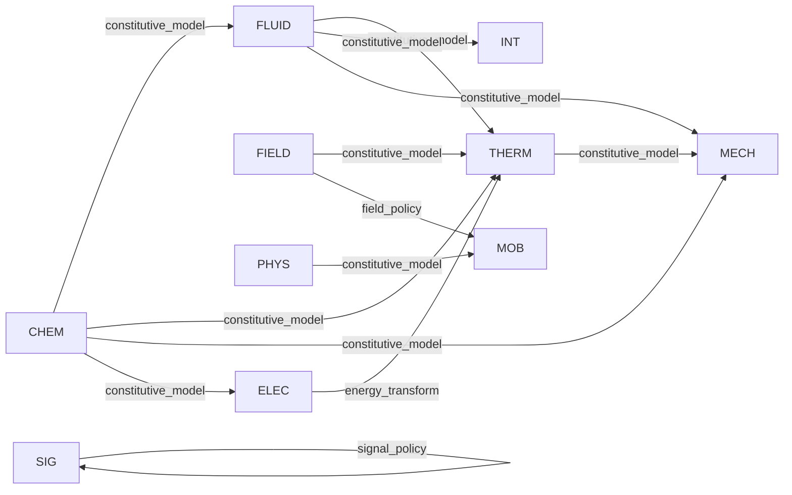

Status: DERIVED
Last Reviewed: 2026-03-16
Supersedes: none
Superseded By: none
Stability: provisional
Future Series: DOC-CONVERGENCE
Replacement Target: canon-aligned documentation set for convergence and release preparation

# GLOBAL Coupling Graph

Date: 2026-03-05
Phase: `GLOBAL-REVIEW-3`

## Audit Result
- Strict AuditX coupling findings:
  - `E217_UNDECLARED_COUPLING_SMELL`: 0
  - `E247_CROSS_DOMAIN_BYPASS_SMELL`: 0
- Registry-declared coupling contracts: 13
- All declared cross-domain paths use allowed mechanisms (`constitutive_model`, `energy_transform`, `field_policy`, `signal_policy`).

## Declared Couplings
| Contract ID | From | To | Mechanism | Mechanism ID |
| --- | --- | --- | --- | --- |
| `coupling.elec.loss_to_therm.heat` | `ELEC` | `THERM` | `energy_transform` | `transform.electrical_to_thermal` |
| `coupling.field.irradiance_to_therm.heating` | `FIELD` | `THERM` | `constitutive_model` | `model.phys_irradiance_heating_stub` |
| `coupling.therm.temperature_to_mech.strength` | `THERM` | `MECH` | `constitutive_model` | `model.mech.fatigue.default` |
| `coupling.sig.trust_to_acceptance` | `SIG` | `SIG` | `signal_policy` | `belief.default` |
| `coupling.field.friction_to_mob.traction` | `FIELD` | `MOB` | `field_policy` | `field.profile_defined` |
| `coupling.phys.gravity_to_mob.force` | `PHYS` | `MOB` | `constitutive_model` | `model.phys_gravity_force` |
| `coupling.fluid.heat_to_therm.exchange` | `FLUID` | `THERM` | `constitutive_model` | `model.fluid_heat_exchanger_stub` |
| `coupling.fluid.leak_to_int.flood` | `FLUID` | `INT` | `constitutive_model` | `model.fluid_leak_flood_stub` |
| `coupling.fluid.pressure_to_mech.load` | `FLUID` | `MECH` | `constitutive_model` | `model.fluid_pressure_load_stub` |
| `coupling.chem.degradation_to_fluid.restriction` | `CHEM` | `FLUID` | `constitutive_model` | `model.chem_scaling_rate.default` |
| `coupling.chem.degradation_to_therm.conductance` | `CHEM` | `THERM` | `constitutive_model` | `model.chem_fouling_rate.default` |
| `coupling.chem.degradation_to_mech.strength` | `CHEM` | `MECH` | `constitutive_model` | `model.chem_corrosion_rate.default` |
| `coupling.chem.degradation_to_elec.insulation` | `CHEM` | `ELEC` | `constitutive_model` | `model.chem_corrosion_rate.default` |

## Mermaid Graph

## Repairs Applied
- No additional code refactor required in this phase.
- Coupling discipline remained compliant after Phase 2 substrate cleanup.
