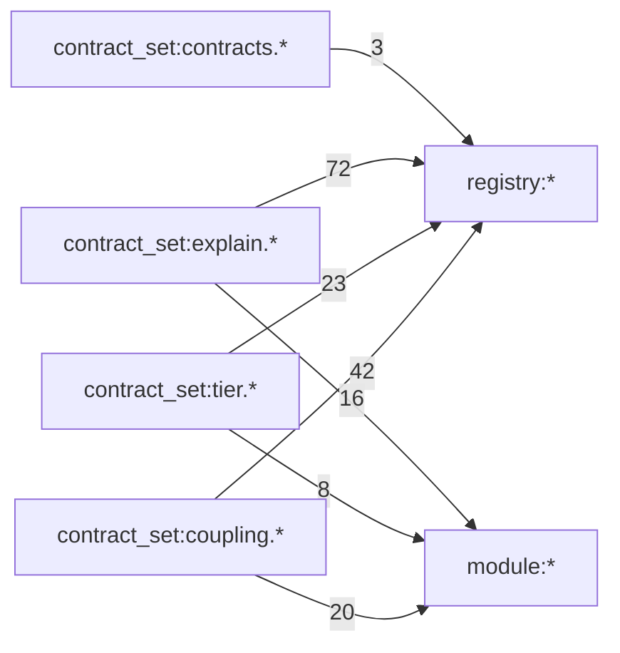

Status: DERIVED
Last Reviewed: 2026-03-16
Supersedes: none
Superseded By: none
Stability: provisional
Future Series: DOC-CONVERGENCE
Replacement Target: canon-aligned documentation set for convergence and release preparation

# GR3 Contract Graph

Source artifact: `docs/audit/TOPOLOGY_MAP.json`  
Contract-edge subset: edges with `from_node_id` prefixed `contract_set:`

## Contract Edge Summary
- Contract-origin edges: `184`
- Edge kinds:
  - `depends_on`: `119`
  - `enforces`: `44`
  - `consumes`: `21`

## Contract Families in Graph
- `contract_set:coupling.*` nodes: `21`
- `contract_set:tier.*` nodes: `23`
- `contract_set:explain.*` nodes: `72`

## Aggregated Flow (family -> target class)
- `explain -> registry`: `72`
- `coupling -> registry`: `42`
- `tier -> registry`: `23`
- `coupling -> module`: `20`
- `explain -> module`: `16`
- `tier -> module`: `8`
- `contracts -> registry`: `3`

## Mermaid (Aggregated)

## Operational Interpretation
- Contract enforcement and discovery remain registry-driven.
- Module-facing contract edges are bounded and explicit (no global wildcard edges).
- This graph remains compatible with META-CONTRACT hard gates (tier/coupling/explain).
